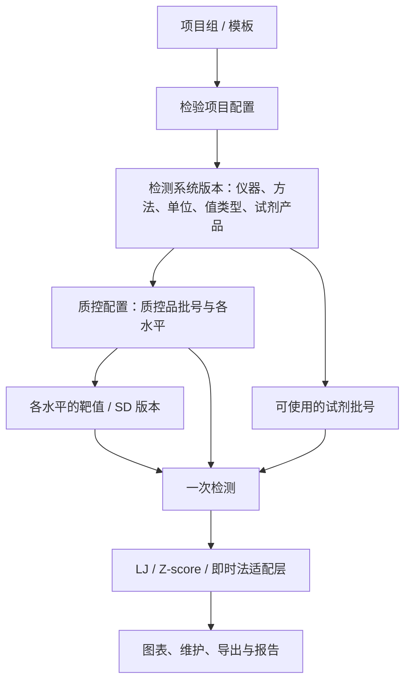

# 仪器、试剂与质控品批号的整体改造设计

日期：2026-09-11。

状态：2026-09-11 已完成首轮本地实现。本文保留实施前的问题分析和整体目标，实际已实现范围、操作步骤及剩余限制以 [实现与验收说明](v1_2_lot_lifecycle_implementation.md) 为准。

## 1. 产品目标

同一检验项目可以长期使用，试剂和质控品分别管理批号。日常换批通过现有项目下的换批流程完成，保留每次检测的真实上下文。统一覆盖 LJ、Z-score、即时法及即时法转入 LJ。

项目组/模板可以容纳多个检验项目。共用复合试剂盒的检测项可以共用试剂批号；使用独立试剂的检测项分别选择。复合质控品用于多个检测项，不意味着这些检测项共用一种试剂。

整体改造覆盖基础资料、项目管理、录入、计算上下文、图表、导入导出、月报与历史追溯。保留现有统计算法和已确定的维护规则，用统一服务传入正确的数据与参数。

## 2. 实施前核实的代码现状

| 能力 | 当前实现 | 本轮设计需要解决的问题 |
|---|---|---|
| 字典 | `services/master_data_service.py`、`migrations/v1_1_master_data.py` 已有试剂产品、质控品批号及水平 | 缺少独立的试剂批号实体 |
| 模板 | 模板默认试剂及每个检验项目的试剂 ID 已实现 | 默认试剂只是新增时预填，不能承担检测时的批号追溯 |
| 质控品换批 | `services/project_config_service.py` 已有复制批号、水平配置和配置快照 | 增加明确的验证、平行使用、启用、结束使用流程；结束使用后仍可查历史 |
| LJ | `pages/lj_sections.py`、`results.reagent_lot_changed`、`plotting.py` 已有换批勾选和竖线 | 只有事件布尔标记，没有新旧批号、验证和实际使用批号 |
| LJ 配置同步 | `services/workbench_config_service.py::_materialize_runtime_batch` 会更新已有运行批次 | 需要冻结已有检测的配置上下文，不能随字典或上游配置改变 |
| Z-score | `services/zscore_workbench_service.py` 已有配置快照和已有结果保护 | 快照目前按整批绑定，不能直接承担一批质控品内的多次试剂换批 |
| 即时法 | 已接入新版单水平配置，批次快照随人工转入 LJ 保留，详见 `v1_2_instant_workbench_integration_spec.md` | 继续接入统一换批服务，把整批上下文扩展到每次检测，同时保留 SI 计算和转入 LJ 链路 |
| 控制参数 | LJ/Z-score 新版配置目前只接入本批次建靶；管理页可存其他来源 | 控制参数的来源、验证和生效版本需要贯通工作台，避免把厂家参考值直接变成正式靶值 |
| 报告 | `services/report_service.py` 已有 LJ/Z-score 月报和生成摘要 | 增加实际批号、换批事件和靶值版本；跨批号统计要分开 |

已用现有 LJ 测试种子在临时数据库复现：录入一条 LJ 结果后修改试剂字典名称，再执行绑定同步，已有运行批次的试剂名称随之变化。测试未改动本地业务数据库。这是追溯改造第一阶段必须修复的问题。

## 3. 统一概念与数据关系

必须区分：

- 检验项目身份：例如葡萄糖，不因日常换批重建。
- 检测系统版本：方法学、单位、值类型、实际仪器或试剂产品发生重要变化时创建新配置版本，评估可比性；不覆盖旧检测系统。
- 试剂批号：同一试剂产品的不同生产批号，可以在同一质控品使用期内更换多次。
- 质控品批号：相应材料及水平的批号，决定控制参数的适用对象。
- 靶值版本：某检测系统、检测项、质控品批号和水平下确认的均值、SD、来源与生效范围。
- 一次检测：实际发生的结果。Z-score 中一次检测包含多个水平；项目组的多个检验项目不自动合并成一个 Z-score run。

### 建议增量模型

以下名称为设计名称，实际建表前需与现有约束一起落实。

| 实体 | 核心信息 | 兼容策略 |
|---|---|---|
| `md_reagent_lots` | 试剂产品 ID、批号、效期、资料来源和停用状态 | 产品+批号唯一；开瓶/上机日期属于具体使用记录，不作为同一生产批号的全局属性 |
| `qc_lot_verifications` | 验证类型、检测项/系统、待验证批号、对照批号、结论、依据/附件、人员、日期 | 保存实验室验证记录；不自行编造所有项目通用的样本数或接受界限 |
| `qc_reagent_lot_usage` | 系统配置、试剂批号、默认使用期间、对应验证记录 | 批量切换需显式勾选受影响检测项；不能按厂家或模板名称推断全部项目都换批 |
| `qc_lot_change_events` | 事件类型、新旧批号、实际生效时间、录入时间、原因、操作者、关联验证 | 已生效事件以追加更正记录修订，不删除历史；撤销“当前默认选择”不反向改写结果 |
| `qc_target_profiles` / 水平明细 | 项目与系统、质控配置、各水平均值/SD、来源、依据、确认人、生效版本 | 复用当前水平配置和建靶输出，形成不可变版本，结果引用明确版本 |
| `qc_result_contexts` / 水平明细 | 对应 LJ 结果、Z-score run 或即时法结果，配置快照、实际试剂批号、质控品批号/水平、靶值版本 | 三种结果使用明确的外键和“恰有一种结果引用”约束；Z-score 水平明细保存各水平上下文 |
| `qc_result_evaluations` | 对应结果上下文、计算/规则版本、参数依据、阶段、各水平证据及最终结论、生成时间、重算来源 | 保存当时判定；建靶观察可记录暂定状态。维护后的重算追加版本，界面区分当时判定与当前有效数据回顾 |

现有 `qc_project_templates`、`qc_project_template_items`、`qc_lot_configs`、`qc_lot_config_items` 和 `qc_workbench_bindings` 继续使用。三套原始结果表保留，不在此次改造中合并重写。

已有 `qc_config_snapshots` 记录配置修订；新增结果上下文记录“本次实际使用了哪个修订”。两者职责不同，不能仅在报告时查询最新配置。

## 4. 换试剂批号

用户流程：当前项目或项目组 → 更换试剂批号 → 选择检测项与新批号 → 关联验证结论 → 确定启用时间 → 预览受影响项目 → 保存。

目标规则：

1. 沿用检验项目和当前质控品配置；单纯换试剂批号不创建新的质控品批次。
2. 启用新试剂前按适用要求完成验证，保存具体结论与依据。一个复合试剂盒涉及多个检测项时，每项须能查到对应验证结论，不能默认一项通过代表全部通过。
3. 原靶值是否继续适用由评估确定。换批按钮不自动重算均值/SD，不自动放宽控制限，不清空既往异常。
4. 若控制参数仍适用，保留同一统计观察序列及原有连续规则窗口，换批处加事件标记，继续观察偏移。
5. 如需修订控制参数，走独立的“靶值修订”流程，有依据、确认与生效版本；不能把它藏在换批操作中。新版本的规则窗口边界必须明确。
6. 检测保存时同时固化使用批号。补录过去检测时，按检测时间给出建议批号，操作者确认；不能把今天的当前批号自动填入所有历史结果。
7. 多个批号同时可用时，默认选择只帮助录入，实际结果仍可明确选择其使用批号。发生歧义时不能仅按日期猜测。
8. 启用事件与默认使用记录应在同一事务提交。已打开但未保存的表单遇到配置切换，要提示重新确认，避免界面显示旧批号、实际却保存新批号。

## 5. 换质控品批号

用户流程：当前项目组 → 更换质控品批号 → 选择新批与水平 → 复制项目配置 → 平行检测/确认控制参数 → 启用新批 → 结束旧批使用。

目标规则：

1. 沿用项目模板及检验项目；创建新的质控品批号配置和统计序列。
2. 复制仪器、检测项、方法、单位、值类型等结构，不把旧批检测值复制成新批检测值。
3. 原批建靶结果不能静默成为新批靶值。新批需建立或确认控制参数，相关长期精密度资料可以作为有依据的评估来源。
4. 保留现有 `copy_lot_config` 的保护：建靶来源在新批中重建；复制的厂家/人工控制参数标为待确认。
5. 新旧批可同时存在并平行录入，各用自己的参数和统计。多个检测项可以分别完成验证和启用，不能强迫整个项目组一次全部切换。
6. “已启用的有效配置”“当前默认使用”“平行验证中”“结束使用”“软停用”分开表达。结束使用的记录仍可查询、导出和报告。
7. 质控品低、高水平可能具有不同厂家批号，模型应允许按水平保存真实批号。现有“一个父批号包含全部水平”自动映射为同批水平，不伪造独立批号。
8. 单个水平换批时，创建新的水平组合版本；保留未变化水平的已确认参数来源，新水平单独验证。不能悄悄改写旧 run 的水平组合。

为适应现有 Z-score 联合判定，新的水平组合在所有必需水平的参数确认前不输出正式联合结论；不能将一半建靶、一半正式的结果当成完整正式 run。实现时要覆盖这一场景，不能仅修改数据库字段就开放入口。

## 6. 对现有三种方法的处理

| 方法 | 继续保留的规则 | 换批接入方式 |
|---|---|---|
| LJ | 单水平建靶、Westgard、离群维护、正式期限制 | 同一质控品下换试剂记录事件；质控品换批独立统计；原换批勾选升级为有详情的事件 |
| Z-score | 2/3 水平、任一水平 reject 则整次 reject、按 run 维护、正式期只读、视图保持 | run 与各水平绑定真实上下文；新旧质控批/水平组合独立；试剂换批标记同步展示 |
| 即时法 | 单水平；3 个有效点开始 SI 检验；20 个有效点后提示人工转 LJ；转入后源批只读 | 接入统一项目/批号入口；同质控批试剂换批需验证并记录，新质控批单独累计有效点 |
| 即时法 → LJ | 保留现有人工确认、重复转入保护、有效点选择与来源关联 | 复制结果时同步复制/关联每个源结果的批号上下文、换批事件与来源 ID；内部方法转换不显示成用户又建了一个检验项目 |

即时法现有转入规则是前 20 个有效点成为 LJ 建靶点，之后有效点成为正式期点。此规则在换批改造中保持；不同质控品批号的点不得混合凑够 20 个。若试剂变更造成数据不可比，应走明确的评估与新观察序列流程，不自动拼接。

控制参数来源要同时贯通 LJ 和 Z-score：

- 本批次建靶：沿用已有计算；建靶期间参数可随有效数据更新，明确为暂定观察。在正式使用时固化参数、来源结果集合及版本，不把最后形成的靶值冒充早期检测时已经存在的靶值。
- 厂家/手工来源：经过明确确认后才可作为正式参数输入；当前“厂家参考值”继续只是参考。
- 复制待确认：不能进入正式判定。
- 控制参数修订：保留旧版本与旧判定，新检测使用新版本；历史回顾重算作为独立产物标明依据。

新参数版本或新质控品水平组合使用独立的连续规则窗口，这是拟采用的软件边界，需通过专门用例验证；单纯试剂批号变更不自动重置窗口。

## 7. 图表、记录、导入导出与报告

- LJ 复用现有换批竖线；Z-score 和即时法使用同一事件来源。事件标明试剂换批、质控品换批、校准或靶值修订等类型，避免一个标记承担多种含义。
- 默认图按明确的质控配置和控制参数版本显示；跨质控品批号回顾以分区或明确标注的标准化视图展示，禁止把不同批号原始值直接混算同一均值/SD。
- 建靶期也允许记录试剂换批事件；更新当前 LJ 导入说明中偏向只在正式期填写的文案。
- 记录表和导出包含实际仪器、试剂产品及批号、各水平质控品批号、输入值类型、控制参数版本、换批标记及来源。
- 旧 CSV 仍可导入。只有“试剂批号变更=是”但缺少批号时，保留为批号未记录的历史事件，不能猜测新旧批号。
- 导入预览先解析批号与上下文，存在歧义的行要求明确匹配；批量导入与手工录入使用同一校验和保存服务。
- LJ/Z-score 月报列出报告期内实际使用的批号及换批事件，并按质控批/控制参数版本分开统计。不能只在页眉打印当前最新试剂批号。
- 保留已生成报告的原始摘要；“按当前数据重新生成”生成新报告版本，保留来源与生成时间，不冒充原报告。
- 即时法当前没有与 LJ/Z-score 等同的正式月报功能。先贯通其图表、记录导出及转入后的 LJ 报告，不能在验收中宣称已实现即时法月报。

## 8. 历史数据与迁移

1. 修改前使用 SQLite backup 建立完整备份，核对迁移前结果数、关键值和配置 ID。
2. 采用幂等加表、加列和受控回填；保留原表、ID、输入值、检测时间、人工维护状态及来源关联。
3. 已有可靠快照的结果使用其原始上下文；没有历史快照的数据只能注明“迁移时已有资料”，不能宣称恢复了实际检测时资料。
4. 旧结果没有记录试剂批号时保存为未记录，后续可以有审计地补充，禁止批量套用当前试剂批号。
5. 旧 LJ `reagent_lot_changed` 标记保留，映射为信息不完整的历史换批事件；不删除原字段以维持旧导入和测试兼容。
6. 旧测试项目继续遵循现有“不导入新版管理入口”的口径，但结果和报告保持可追溯；即时法转入 LJ 的有效业务链路单独保护。
7. 引用资料改名、停用或结束使用不改变历史显示。失活配置的历史查询与新录入权限分开处理。
8. 迁移后验证完整性和外键、结果数量与值不变，再检查三方法绑定及报告。回退必须恢复配套备份；不能在新版本已经录入新结果后直接用旧数据库覆盖而丢失记录。

## 9. 实施顺序与模块边界

分阶段开发、按统一闭环验收；阶段性完成不能对外宣称“换批完整支持”。

| 顺序 | 工作包 | 主要模块 | 完成条件 |
|---|---|---|---|
| 1 | 统一历史上下文与参数边界 | 新增迁移与上下文服务，`workbench_config_service.py`、`zscore_workbench_service.py`、`database.py` | LJ/Z-score 已有结果不被同步覆盖；可靠快照与未知历史资料区分；结果上下文写入原子化 |
| 2 | 三方法统一配置和批号实体 | `master_data_service.py`、`project_config_service.py`、新增即时法适配服务、`instant_page.py` | 试剂批号、验证记录、质控批配置统一；即时法 3/20 点及转 LJ 追溯无回归 |
| 3 | 两种换批流程与控制参数版本 | 新增换批/靶值服务，共用换批 UI，LJ/Z-score/即时法录入与导入适配 | 试剂换批保持观察连续性；质控品换批独立统计；平行批、分项目切换、靶值来源可用 |
| 4 | 图表、报告、历史与整体验收 | `plotting.py`、`zscore_plotting.py`、即时法绘图、`report_service.py`、导入导出、维护与测试 | 三方法实际使用批号一致；月报跨批正确；用户可完整走通换批和历史回顾 |

复杂判断进入服务层。页面负责选择、预览、提示和提交，避免三种页面各写一套换批逻辑。

## 10. 验收矩阵

以下属于最终交付要求，不能只检查新增表单：

1. 同一检验项目从试剂 R001 切换到 R002，质控品仍为 Q001：项目身份、既有结果、原控制参数和连续规则窗口不被自动重置。
2. 同一项目从质控品 Q001 切换 Q002：不要求复制检验项目；新旧批独立统计并能平行录入。
3. 同一项目组内只切换部分检测项，其余检测项批号不变；复合试剂盒可明确选择多个检测项一起切换。
4. Z-score 两水平和三水平分别验证；按 run 判定及维护保持；单水平换批不能污染历史水平组合。
5. 即时法在换试剂后继续可比观察，换质控品后另行累计；含换批事件的有效点转 LJ 后逐条可追溯。
6. 正式期建靶记录继续只读，换批入口不能绕过原有锁定；停用和恢复不硬删除结果。
7. 修改字典名、模板默认试剂、当前使用批号和靶值版本后，历史结果与已有报告保持原上下文。
8. 补录换批前的结果、同日两次换批、相同检测时间、多个可用批号和多窗口同时操作，都有确定的结果批号与版本。
9. 有结果后的事件更正保留前后记录及原因；不能静默改变既往结果。使用期查询和实际检测记录不一致时能发现。
10. 新旧 CSV、XLSX 导入导出和手工录入关联一致；未知批号不能被默默补成当前批号。
11. 跨月、月内换批和月内靶值修订的图表与月报按实际数据分组，原始值、Ct 和 log 三类输入语义保持。
12. LJ/Z-score/即时法及现有离群、迁移、存储、报告测试全部通过；浏览器实测连续保存、合并视图、单点图例和较窄窗口。

## 11. 资料依据与设计边界

- [NATA 的 ISO 15189:2022 条款对照](https://nata.com.au/files/2023/03/SAG_11_2_ISO_15189_2022_Gap_Analysis.pdf)：6.6.3 涉及新试剂批次等的性能验证，6.6.7 涉及相关记录；7.3.7.2 a) 2) 建议避免质控品与试剂/校准品在同一天或同一次检测中同时换批，以利于识别批间变化。
- [CLSI EP26 官方说明](https://clsi.org/shop/standards/ep26/)：按检测方法制定试剂批间评价方案，关注患者样本结果的可接受差异；并非所有项目适用同一验证方案。
- [Westgard 关于质控品新批的说明](https://www.westgard.com/questions/quest9.html)：通过新旧质控品平行观察评估新批控制参数，并可结合已有精密度资料。

本文的数据库、页面入口、状态及规则窗口边界是软件设计建议，不是标准规定的软件结构。验证参数由适用规范、厂家说明与实验室方法/SOP确定。既有 5–20 点建靶和即时法 3/20 点规则继续按本软件当前规格执行，不把它们表述为 ISO 对所有检测的统一数值要求。
